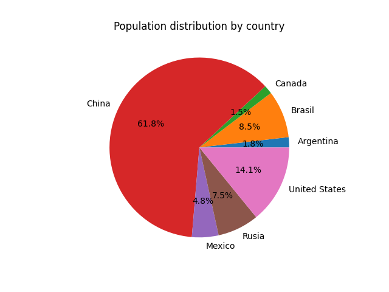
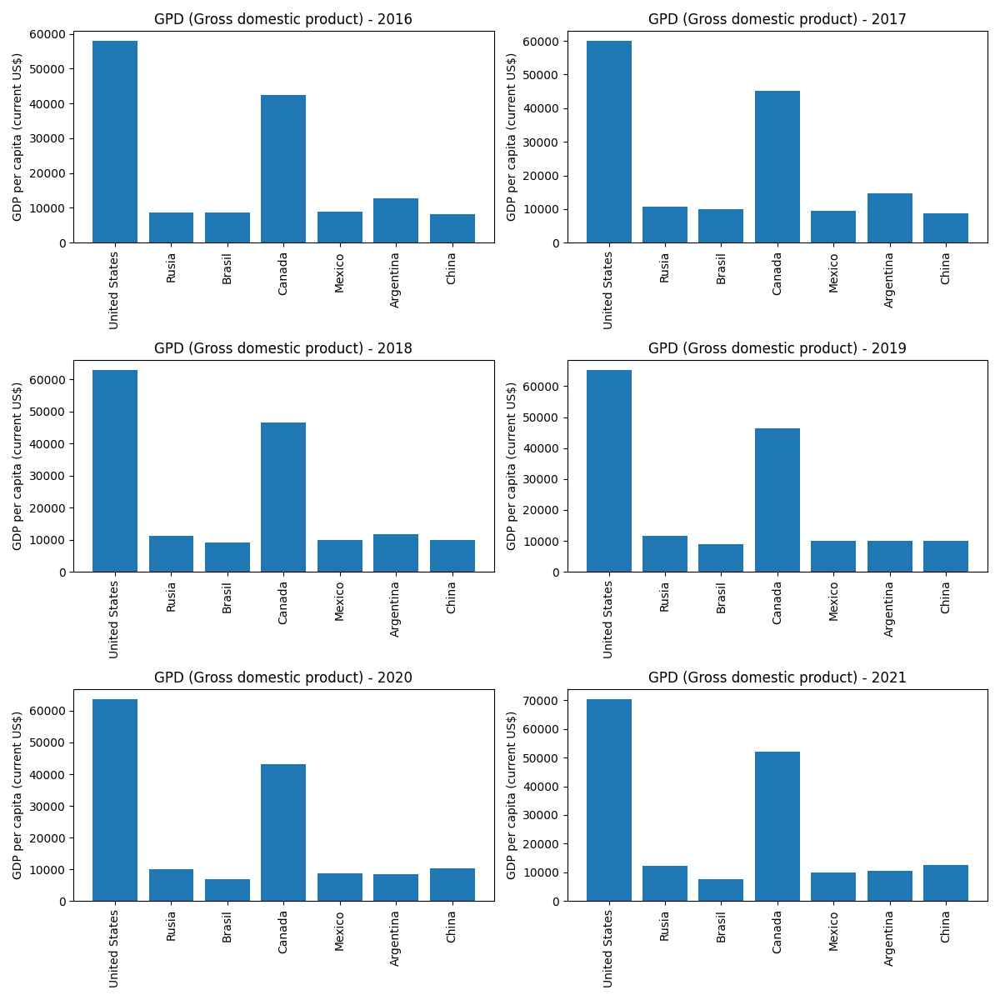
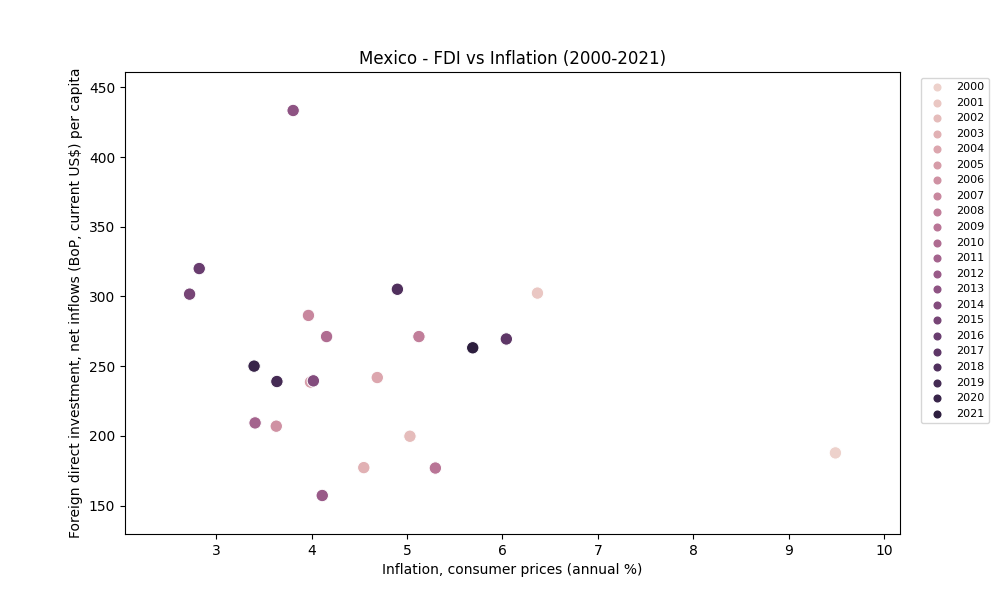

# Ventagium - TAKE HOME ASSIGNMENT – Rodrigo Orozco

This project was done in order to enter to Ventagium Data Consulting.
You can find the instructions in the general notes section.

<details><summary><h2>General Notes</h2></summary>
<p>

## Activate virtual env and check if pip is up-to-day
```
source env/bin/activate
python3 -m pip install --upgrade pip
```

## Instructions
Crear un pipeline con Python, el cual debe: 

1. Extraer los datos correspondientes al total de población de cada país a través de los años usando la API JSON de Indicadores del Banco Mundial.  
[Documentación](https://datahelpdesk.worldbank.org/knowledgebase/articles/889392-about-the-indicators-api-documentation)
[URL para extraer información sobre totales de población](http://api.worldbank.org/v2/country/all/indicator/SP.POP.TOTL?format=json)

 > Puedes usar el parámetro page=n para obtener la página número n. 

2. Almacenar los datos extraídos en un objeto DataFrame de la librería Pandas.
3. Presenta la información importante que hayas encontrado sobre la población de cada país usando los modelos que creas más convenientes.  
4. Analizar los resultados y proporcionar conclusiones generales sobre el desempeño de los modelos que utilizaste. Siéntete libre de usar herramientas de visualización de datos para presentar tus resultados. 

> Haz tu mejor esfuerzo para crear código simple, leíble, eficiente, modular y de preferencia basado en objetos. Debes enviar tu código y resultados al correo guillermo.carsolio@ventagium.com 1 día antes de tu entrevista. 

</p>
</details>

<details><summary><h1>Description of worldbankapi.py</h1></summary>
<p>

## WorldBankAPI class
This file contains the WorldBankAPI class to connect to The World Bank API that allows for the search and retrieval of the public, Bank documents available in the Documents & Reports site.  Records can be retrieved in a format useful for research and for inclusion in web sites outside of Documents & Reports and the World Bank. To read more about it, visit [World Bank API documentation](https://datahelpdesk.worldbank.org/knowledgebase/articles/889392-about-the-indicators-api-documentation)

## Methods of the World Bank API class
The class WorldBankAPI() recieves the country code to work.
It contains several methods that allows us to consult the following indicators about the country given as the parameter and also need the ISOcode of the country.

1. To consult the population use:
```
get_population(country_code)
```

2. To consult the Gross Domestic Product (GPD) use:
```
get_gdp_per_capita(country_code)
```

3. To consult the health expenditure per capita use:
```
get_health_exp_per_capita(country_code)
```

4. To consult the inflation rate per year  use:
```
get_inflation(self, country_code)
```

5. To consult the unamployment (% of total labor force) use:
```
get_unemployment(country_code)
```

6. To consult the Foreign Direct Investment (FDI) use:
```
get_fdi_data(country_code)
```

For the purpouse of the task, the most important method is:
````
get_all_data(country_code, country_name)
````
It allows us to retrieve all the data from the previous methods, generates a dataframe and saves them into a CSV file.

</p>
</details>

<details><summary><h1>Description of countrieswb.py</h1></summary>
<p>
The file counstrieswb.py only stores a single class and it is used to consult and create the list with tuples of all the continent and territories.
The method inside this get_countries() retourns a list of tuples, it is useful because we have the relationship between the name and the isocode.
</p>
</details>

<details><summary><h1>Description of graphics.py</h1></summary>
<p>
Its purpose is to plot charts using the dataframes created in the for cicle using the worldbankapi class.
> The charts are being store in the charts directory.

There are four classes that generate charts.

<h2> 1. Population chart class </h2>

It generates a circle chart using the dataframe with all the countries. It only need the dataframe to work, in the project, it is being used like that:
```
PopulationChart(df_all)
population_chart.plot()
```
Example of the chart generated:
<p align="center">
  
</p>

<h2> 2. GDP bar chart </h2>

It generates a bar chart using the dataframe with all the countries. It needs the dataframe to work and the starting year to show. In the project, it is being used like that:
```
gdp_chart = GDPChart(df_all, 2016)
gdp_chart.plot()
```
Example of the chart generated:
<p align="center">
  
</p>

<h2> 3. Unemployment line chart </h2>

It generates a line chart using the dataframe with all the countries. It only needs the dataframe to work. In the project, it is being used like that:
```
unemployment_chart = UnemploymentChart(df_all)
unemployment_chart.plot()
```
Example of the chart generated:
<p align="center">
  
</p>

<h2> 4. FDI vs Inflation Chart </h2>

It generates a scatter chart using the dataframe with all the countries. You need to type as parameters the dataframe, the country and the start year (In this case the start year is not needed because it was declared in graphics.py as 2000). In the project, it is being used like that:
```
chart = FDIInflationChart(df_all, 'Mexico')
chart.plot()
```
Example of the chart generated:
<p align="center">
  
</p>
>Note: Remeber that this graphic is only for one country.

</p>
</details>

<details><summary><h1>Description of project.py</h1></summary>
<p>
Project.py is the main file of the project because it is responsible of run the classes and methods needed to achieve the goal descrived in the instructions.

Basically, at this moment is calling the CountriesWBAPI class to get all the countries as a list of tuples and use it to iterate a for cicle using the name of the country and the code. Inside this cicle the WorldBankAPI class is called to generate all the data from the country list.
> Currently the cicle is stoping with a count of 9 countries, because of testing purpouses.
   
</p>
</details>

<details><summary><h1>Description of tester.py</h1></summary>
<p>
The tester.py file 
</p>
</details>